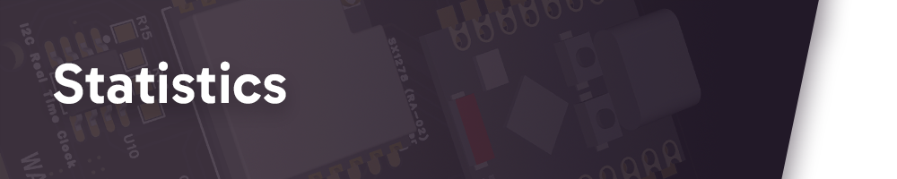

## Leaving my mark on this **world** ~ 🌍

	

> 🔩 I want to leave my mark on this complex world, mixing every bit of my knowledge to produce matter in every form possible.

 

- 🧠**Main OS**: 
- 💻 **Prog. Flow**:     

- 🎓 **Education**: Engineering School in Informatics and Electronics
- 📚 **Hobbies**: Cinema, Reading papers, Space and Photography
- 🛠️ **Interests**: Embedded systems, Low-level, Game development, Retro computing, Kernel development
- 💬 **Languages**: French, English 

 

	

 

<!-- Most Used Languages -->

  <picture>
    <source
      srcset="https://github-readme-stats.vercel.app/api/top-langs/?username=yoboujon&layout=donut&size_weight=0.5&count_weight=0.5&langs_count=5&exclude_repo=saoulbonmonsieur&theme=dark"
      media="(prefers-color-scheme: dark)"
    />
    <source
      srcset="https://github-readme-stats.vercel.app/api/top-langs/?username=yoboujon&layout=donut&size_weight=0.5&count_weight=0.5&langs_count=5&exclude_repo=saoulbonmonsieur"
      media="(prefers-color-scheme: light), (prefers-color-scheme: no-preference)"
    />
    
  </picture>

 

	

 

